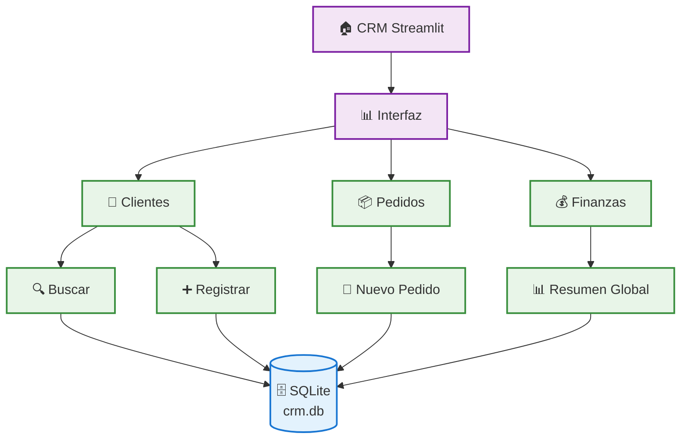
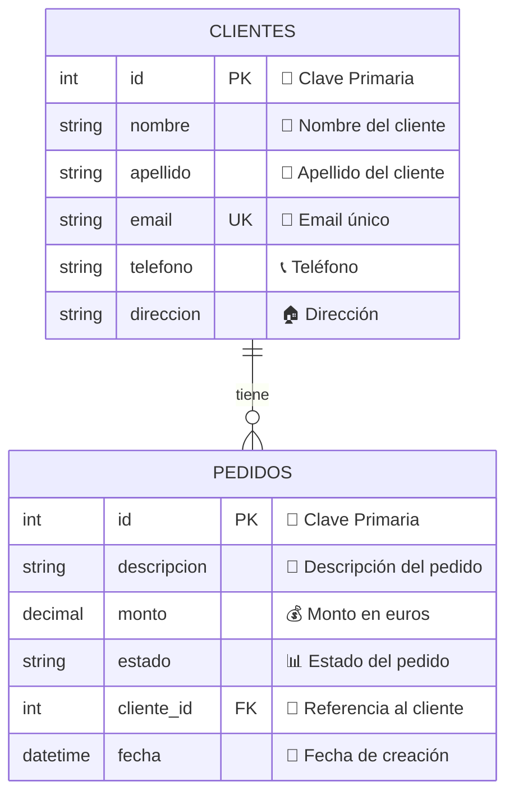

# 🏢 CRM Básico - Sistema de Gestión de Clientes

Un sistema CRM (Customer Relationship Management) desarrollado en Python con Streamlit para gestionar clientes, pedidos y finanzas de manera sencilla y eficiente.

## 📋 Características

- **Gestión de Clientes**: Registrar y buscar clientes por nombre, apellido o email
- **Gestión de Pedidos**: Crear pedidos vinculados a clientes existentes
- **Panel Financiero**: Resumen completo de ingresos, pagos pendientes y cancelados
- **Interfaz Amigable**: Desarrollado con Streamlit para una experiencia de usuario intuitiva
- **Base de Datos Local**: Almacenamiento seguro con SQLite

## 🚀 Instalación

### Prerrequisitos
- Python 3.7 o superior
- pip (gestor de paquetes de Python)

### Pasos de instalación

1. Clona este repositorio:
```bash
git clone https://github.com/tu-usuario/crm-basico.git
cd crm-basico
```

2. Instala las dependencias:
```bash
pip install -r requirements.txt
```

3. **Inicializa la base de datos** (solo la primera vez):
```bash
python main.py
```
Este comando creará la base de datos `crm.db` con las tablas necesarias y datos de ejemplo.

4. Ejecuta la aplicación:
```bash
streamlit run app.py
```

5. Abre tu navegador en `http://localhost:8501`

## 🏗️ Arquitectura del Sistema



## 📊 Estructura de Datos



## 🚀 Inicio Rápido

¿Quieres probarlo inmediatamente? Después de la instalación:

```bash
# 1. Inicializa la base de datos con datos de ejemplo
python main.py

# 2. Ejecuta la aplicación
streamlit run app.py

# 3. ¡Ya puedes explorar el CRM con datos reales!
```

El sistema incluye 5 clientes y 24 pedidos de ejemplo para que puedas probar todas las funcionalidades desde el primer momento.

### 👥 Gestión de Clientes
- **Buscar Clientes**: Filtro por nombre, apellido o email
- **Registrar Clientes**: Formulario con validación de email único
- **Ver Pedidos**: Historial completo de pedidos por cliente
- **Resumen Financiero**: Métricas individuales por cliente

### 📦 Gestión de Pedidos
- **Crear Pedidos**: Vinculación automática con clientes existentes
- **Estados de Pedido**: 
  - ✅ **Pagado**: Pedido completado
  - 🕒 **Pendiente**: En proceso o esperando pago
  - ❌ **Cancelado**: Pedido cancelado
- **Validaciones**: Monto numérico y mayor a cero

### 💰 Panel Financiero
- **Resumen Global**: Vista general de todas las transacciones
- **Métricas en Tiempo Real**:
  - Total de pedidos
  - Ingresos confirmados (pagados)
  - Ingresos pendientes
  - Pérdidas (cancelados)

## 🛡️ Validaciones y Seguridad

- **Email único**: Previene duplicados en la base de datos
- **Validación de formato**: Emails deben contener '@' y al menos un punto
- **Campos obligatorios**: Nombre, apellido y email son requeridos
- **Validación numérica**: Montos deben ser números válidos y positivos
- **Manejo de errores**: Mensajes informativos para el usuario

## 📁 Estructura del Proyecto

```
crm-basico/
├── main.py                # Script de inicialización de BD y datos de ejemplo
├── app.py                 # Aplicación principal de Streamlit
├── crm_schema.sql         # Esquema de base de datos (DDL)
├── crm.db                 # Base de datos SQLite (se crea al ejecutar main.py)
├── requirements.txt       # Dependencias
├── README.md              # Este archivo
└── docs/
    ├── arquitectura.md    # Documentación de arquitectura
    └── estructura-datos.md # Documentación de base de datos
```

## 🗄️ Base de Datos

El sistema utiliza SQLite con las siguientes características:

### Inicialización
- `main.py`: Crea las tablas y carga datos de ejemplo
- `crm_schema.sql`: Define la estructura de las tablas
- Se incluyen **24 pedidos de ejemplo** distribuidos entre **5 clientes**

### Datos de Ejemplo Incluidos
**Clientes:** Juan Pérez, María Gómez, Carlos López, Ana Martínez, Luis Ramírez

**Pedidos:** Productos tecnológicos con diferentes estados (Pagado, Pendiente, Cancelado) y montos que van desde €25 hasta €1,200

## 🚀 Próximas Mejoras

- [ ] Exportar datos a Excel/CSV
- [ ] Gráficos de ventas por período
- [ ] Sistema de notificaciones
- [ ] Gestión de productos/servicios
- [ ] Reportes automáticos
- [ ] API REST para integraciones

## 📧 Contacto

Jorge Gutierrez - [LinkedIn](https://www.linkedin.com/in/jorgegutierrez3/) - jorgericardogutierrez4@gmail.com


