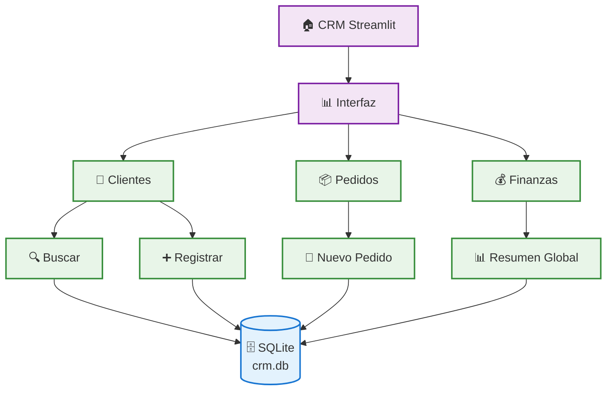

## 🏗️ Arquitectura del Sistema

```mermaid
flowchart TD
    A[🏠 CRM Streamlit] --> B[📊 Interfaz]
    
    B --> C[👥 Clientes]
    B --> D[📦 Pedidos] 
    B --> E[💰 Finanzas]
    
    F[(🗄️ SQLite<br/>crm.db)]
    
    C --> G[🔍 Buscar]
    C --> H[➕ Registrar]
    
    D --> I[📝 Nuevo Pedido]
    
    E --> J[📊 Resumen Global]
    
    G --> F
    H --> F
    I --> F
    J --> F
    
    classDef db fill:#e3f2fd,stroke:#1976d2,stroke-width:2px
    classDef main fill:#f3e5f5,stroke:#7b1fa2,stroke-width:2px
    classDef func fill:#e8f5e8,stroke:#388e3c,stroke-width:2px
    
    class F db
    class A,B main
    class C,D,E,G,H,I,J func
```