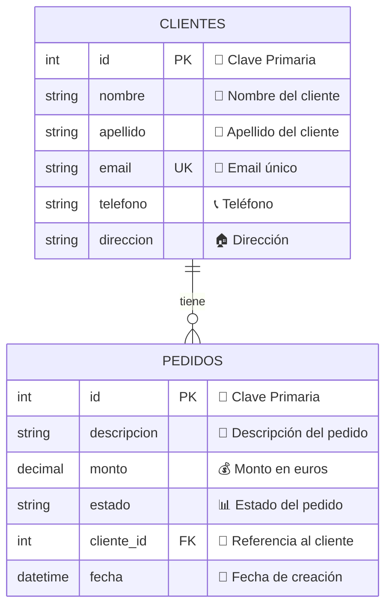

## 📊 Estructura de Datos

```mermaid
erDiagram
    CLIENTES {
        int id PK "🔑 Clave Primaria"
        string nombre "👤 Nombre del cliente"
        string apellido "👤 Apellido del cliente"
        string email UK "📧 Email único"
        string telefono "📞 Teléfono"
        string direccion "🏠 Dirección"
    }
    
    PEDIDOS {
        int id PK "🔑 Clave Primaria"
        string descripcion "📝 Descripción del pedido"
        decimal monto "💰 Monto en euros"
        string estado "📊 Estado del pedido"
        int cliente_id FK "🔗 Referencia al cliente"
        datetime fecha "📅 Fecha de creación"
    }
    
    CLIENTES ||--o{ PEDIDOS : "tiene"
```